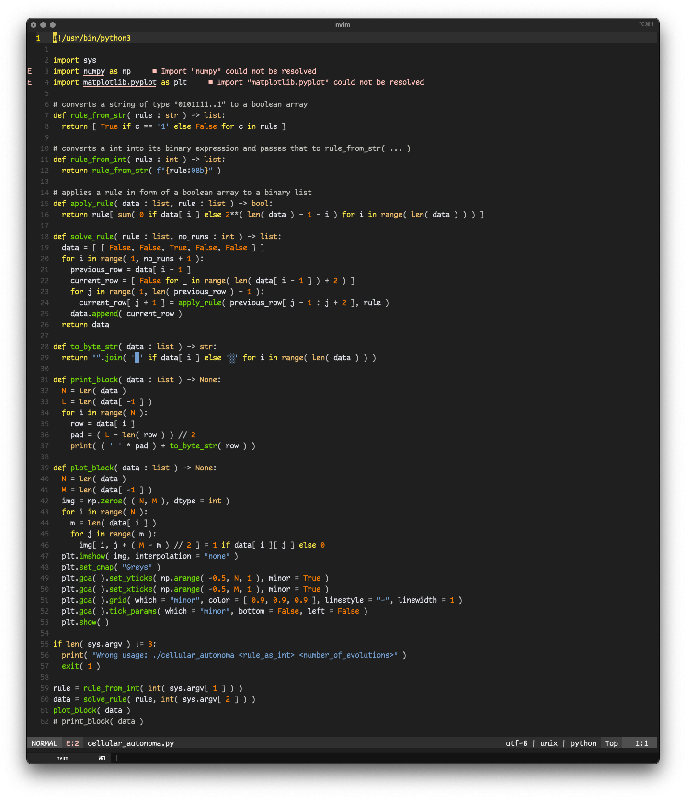

    
    <h1 align = "center"> tango.nvim </h1>

A simple [nvim](https://neovim.io/) color scheme based on the [Tango Desktop Project](https://en.wikipedia.org/wiki/Tango_Desktop_Project) colors.

    

